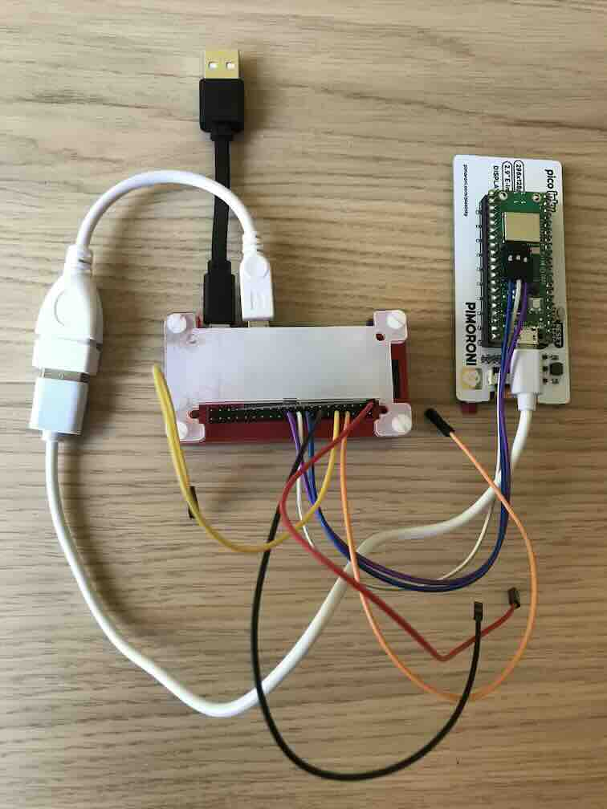

# picoThing

Raspberry Pi Pico W IOT demonstrator.

## Introduction

Objective of this project is to be a template for simple IOT projects with the pico-w using the existing Raspberry Pi Pico W C SDK and built in lwIP stack to its full potential with the following features:
* App-less
* Wi-Fi connected
* Initial Wi-Fi setup by starting in Wi-Fi Access Point mode to open configuration page
* Built in web server with web UI
* Bonjour (mDNS) access
* SNTP time with RTC (AON Timer)
* MQTT
* QR code to display Access point and then URL of the device
* Configuration storage in flash
* Unique naming from mac address
* Power saving
* Using Pimoroni Pico Inky Pack UC8151 display
* VS-Code devcontainer integration with build and debug

Code is kept simple without RTOS and C++ for legibility and reduced flash usage.

Included some CMake examples for subdirectories, libraries and external repositories.

### What it does

The demo reads and displays time and temperature and drive on board LED according to the mode and time and temperature settings.

MQTT allows to behave as slave to change mode which drives the output and read temperature and output state.

## Building

### Native Build
Prerequisites:
* Install Pico C SDK and toolchain according to getting started with Raspberry Pi Pico document (#References).

Build:
```
mkdir build
cd build
cmake -DCMAKE_BUILD_TYPE=Debug -DPICO_BOARD=pico_w ..
make -j4
```
### Docker Build
Prerequisites:
* docker

Build:
```
docker build -t development .
docker run -it --rm -v $(pwd -P):$(pwd -P) -w $(pwd -P) development sh -c 'mkdir build && cd build && cmake -DCMAKE_BUILD_TYPE=Debug -DPICO_BOARD=pico_w .. && make -j4'
```
### VS-Code docker build
Prerequisites:
* docker
* vscode

Build:

Open project and accept the prompt for devcontainer.

Once container built when prompt for compiler choose `arm-none-eabi`.


## Debugging

### Pico Debug probe swd
Use picoprobe for debug.

If using a Raspberry pi:
```
sudo apt install openocd minicom
```
#### gpio serial
```
minicom -b 115200 -o -D /dev/serial0
```
#### usb serial
```
minicom -b 115200 -o -D /dev/ttyACM0
```
### Pico Debug Raspberry Pi SWD
Using Raspberry Pi SWD directly:
```
raspberry pi pin 18 -> pico-w swdio
raspberry pi pin 20 -> pico-w swgnd
raspberry pi pin 22 -> pico-w swclk
```

```
sudo apt install openocd minicom
```
#### openocd debug
```
sudo openocd -c "adapter driver bcm2835gpio" -c "bcm2835gpio speed_coeffs 146203 36" -c "adapter gpio swclk 25" -c "adapter gpio swdio 24" -c "adapter speed 1000" -c "bindto 0.0.0.0" -f target/rp2040.cfg
```
#### gpio serial
```
minicom -b 115200 -o -D /dev/serial0
```
#### usb serial
```
minicom -b 115200 -o -D /dev/ttyACM0
```

### Pico Debug remote openocd



Same as Raspberry Pi SWD but using a raspberry pi zero GPIO as debug probe over wifi.

```
raspberry pi pin 18 -> pico-w swdio
raspberry pi pin 20 -> pico-w swgnd
raspberry pi pin 22 -> pico-w swclk
```

Install [Raspberry Pi OS Lite](https://www.raspberrypi.com/software/operating-systems/) with ssh and in the debug Raspberry Pi:
```
sudo apt install openocd minicom
```
#### openocd debug
```
sudo openocd -c "adapter driver bcm2835gpio" -c "bcm2835gpio speed_coeffs 146203 36" -c "adapter gpio swclk 25" -c "adapter gpio swdio 24" -c "adapter speed 1000" -c "bindto 0.0.0.0" -f target/rp2040.cfg
```
#### gpio serial
```
minicom -b 115200 -o -D /dev/serial0
```
#### usb serial
```
minicom -b 115200 -o -D /dev/ttyACM0
```
#### vscode

Change `gdbTarget` in `.vscode/launch.json` to the debugger raspberry pi ip address

## Wi-Fi
Wi-Fi can be configured in the build with the `WIFI_SSID` and `WIFI_PASSWORD` defines:
```
cmake -DCMAKE_BUILD_TYPE=Debug -DPICO_BOARD=pico_w -DWIFI_SSID=<my ssid> -DWIFI_PASSWORD=<my password> ..
```
in vscode change `cmake.configureArgs` in `.vscose/launch.json`.

When Wi-Fi is not found it will start as an Wi-Fi access point with unique name based on project name and mac address and direct to default page to configure Wi-Fi credentials.

Note that a wifi access point needs a DHCP and DNS server, unfortunately lwIP does not provide one but fortunately there is one in TinyUSB stack in the Pico C SDK.

## web-server
Using lwIP HTTPD with SSI, CGI and makefsdata serializer, files are placed in `fs` directory.

When submitting the configuration on the page it is designed to set the the time and time-zone from the browser. Not normally recommended but is a seamless way to set the time.

## Graphics
Display is used to qr code for device discovery and connection and example data.

Using pimoroni Inky pHAT UC8151 e-paper display. e-paper looks quite good and is low power although is slow to update but suits this application quite well. Note that the display although mounted in a landscape format the hardware raster is actually is in portrait format. The driver and api have the axis swapped to landscape format but the graphics and fonts need to be flipped manually to save processing on the device. 

Provided is a simple API to draw BMP files and draw text, QR codes are created using the QR Code generator library.

### XBM
Import directly.

Only 8 pixels high, invert colours, make mode 1 bit and rotate 90˚ clockwise.

### BMP
Using the file serialization from lwIP makefsdata in `fs` directory.

Multiple of 32 pixels high, make mode 1 bit and rotate 90˚ anti-clockwise.

### Fonts
Fonts can be XBM or BMP.

Use the following string to create a font:
```
 !"#$%&'()*+,-./0123456789:;<=>?@ABCDEFGHIJKLMNOPQRSTUVWXYZ["]^_`abcdefghijklmnopqrstuvwxyz{|}~
```

## TODO
* Low power with suspend and RTC.
* Home Assistant Integration.
* Code tree restructuring for builds with other devices like sensors, actuators etc.

## References
* [Getting started with Raspberry Pi Pico](https://datasheets.raspberrypi.com/pico/getting-started-with-pico.pdf)
* [Raspberry Pi Pico C/C++ SDK](https://datasheets.raspberrypi.com/picow/connecting-to-the-internet-with-pico-w.pdf)
* [lwIP](https://www.nongnu.org/lwip/2_1_x/index.html)
* [CMake](https://cmake.org/)
* [Pimoroni Pico Libraries and Examples](https://github.com/pimoroni/pimoroni-pico)
* [UC8151c e-ink Display Driver](https://github.com/BasicCode/UC8151c)
* [QR Code generator library](https://www.nayuki.io/page/qr-code-generator-library)
* [Custom Fonts for Microcontrollers](https://jared.geek.nz/2014/01/custom-fonts-for-microcontrollers/)
* [iconify](https://iconify.design/) [System UIcons](https://icon-sets.iconify.design/system-uicons/)
* [lwHTTPd](http://scaprile.ldir.com.ar/cms/el-ingeniero/open-source-projects-im-working-on/lwhttpd/)
* [Awaking the Raspberry Pico from deep sleep](https://ghubcoder.github.io/posts/awaking-the-pico/)